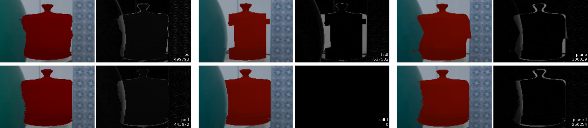
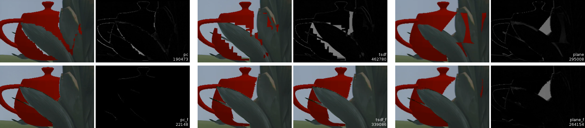

# Masterthesis - Tex 

### Zusammenfassung

> Optimierung von Augmented Reality Anwendungen durch die Berücksichtigung von Tiefeninformationen mit Googles Project Tango

Project Tango ist eine neue mobile Plattform des Google Advanced Technology and Project (ATAP) Teams, die in der Lage ist, Bewegungsverfolgung, Tiefenwahrnehmung und Umgebungswiedererkennung auf Smartphones und Tablets anbieten zu können. Durch die kontinuierliche Bestimmung der relativen Geräteposition eignet sich die Plattform besonders für dreidimensionale Augmented Reality (AR) Anwendungen. Die Illusion dieser AR Anwendungen wird besonders dann gestört, wenn sich reale Objekte in einer Szene räumlich vor virtuellen Objekten befindet und diese virtuellen Objekte nicht entsprechend ausgespart werden. 

Diese Arbeit vergleicht daher drei Überdeckungsverfahren, mit denen diese Überlagerung der virtuellen Objekte mit Hilfe der Tiefenwahrnehmung von Project Tango und des Z-Buffer Algorithmus realisiert werden kann. Die Tiefeninformationen für den Z-Buffer werden hierfür zum einen direkt aus den Sensordaten und alternativ mit einer TSDF Rekonstruktion und einer selbst zusammengestellten Ebenenrekonstruktion bestimmt. Außerdem wird auf einen zusätzlichen Ansatz eingegangen, der zur Verbesserung dieser Tiefeninformationen die Bildinformationen der Farbkamera durch den Guided Filter berücksichtigt. Diese Mechanismen werden im Laufe der Arbeit prototypisch umgesetzt und gegenübergestellt. 

### Abstract

> Optimization of augmented reality applications considering the depth information with Googles Project Tango

Project Tango is a new mobile platform by Google’s Advanced Technology and Projects (ATAP) Teams, which brings Motion Tracking, Depth Perception, and Area Learning to smartphones and tablets. With its Motion Tracking technology, Project Tango is suitable for precise three dimensional augmented reality (AR) applications. The illusion of the model projection in these AR applications is often disrupted when real objects in the scene are located in front of virtual projections, which are not getting occluded.

This presented thesis is comparing three occlusion mechanisms, which can solve the virtual object occlusion with Project Tangos depth perception by applying the Z-Buffer algorithm. The Z-Buffer is filled either by the direct sensor data, by a TSDF reconstruction method or by a self combined and implemented plane based reconstruction. Additionally a guided image filtering approach is applied to the depth map to interpolate according to the edges of the RGB image frame. The proposed mechanisms are prototypically  implemented and comparatively analyzed in detail.

